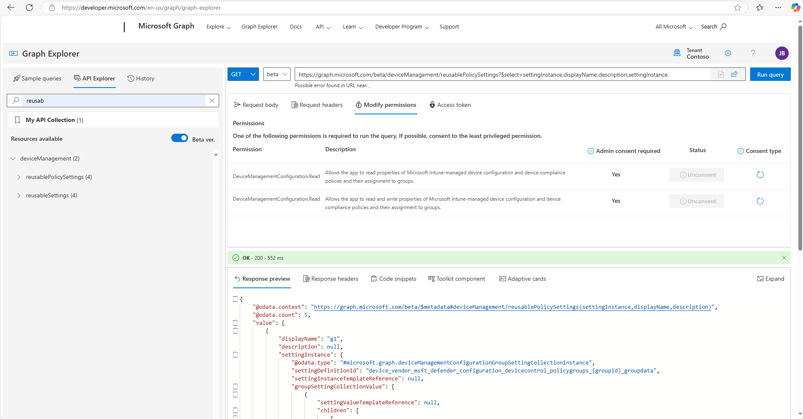
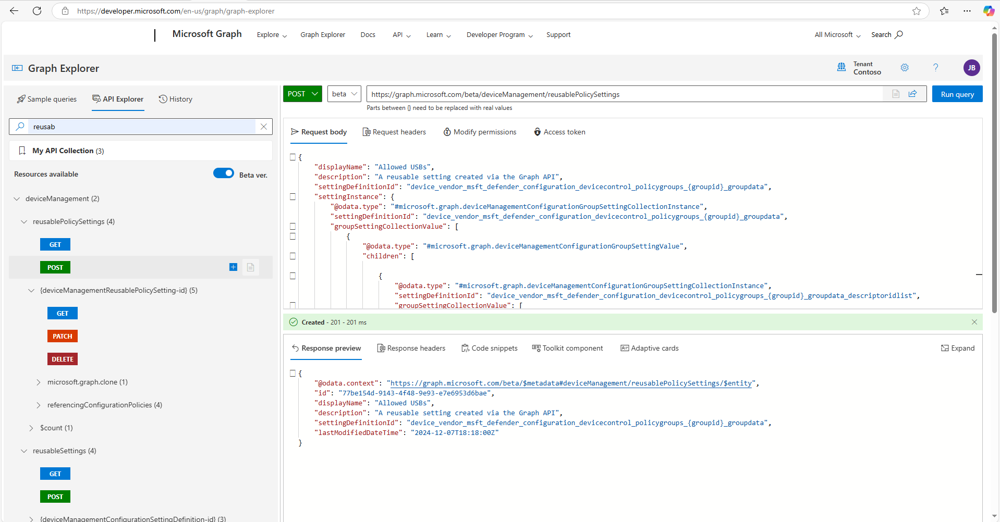
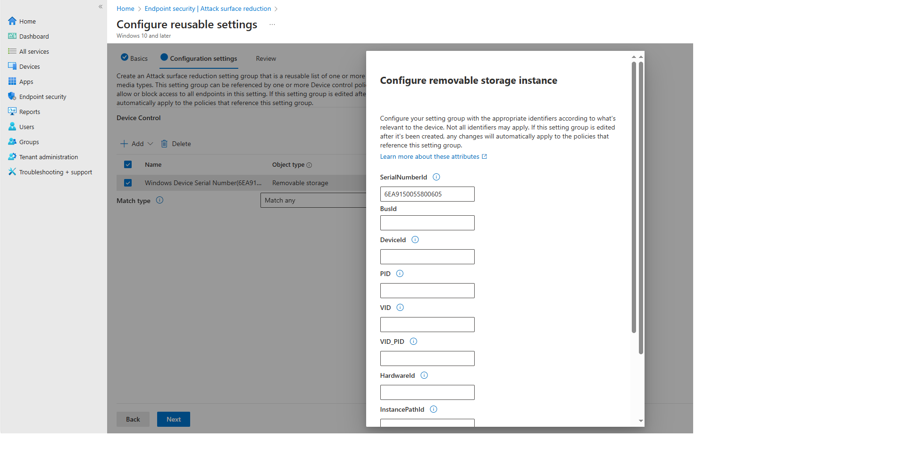

# Using the Graph API with Device Control and Intune

Intune policies for Device Control are made up of two main types of objects in the Graph API - `deviceManagement/reusablePolicySettings` and `deviceManagement/configurationPolicies`

The best way to understand how the Graph API works with device control is by using the [Microsoft Graph Explorer](https://developer.microsoft.com/en-us/graph/graph-explorer)

## Walkthrough of Reusable Policy Settings via Graph Explorer



Using the beta end point, submit the following request:

```
GET https://graph.microsoft.com/beta/deviceManagement/reusablePolicySettings
```

This will return the list of all of the reusable settings define for the tenant

```json
{
    "@odata.context": "https://graph.microsoft.com/beta/$metadata#deviceManagement/reusablePolicySettings",
    "@odata.count": 5,
    "@microsoft.graph.tips": "This request only returns a subset of the resource's properties. Your app will need to use $select to return non-default properties. To find out what other properties are available for this resource see https://learn.microsoft.com/graph/api/resources/deviceManagementReusablePolicySetting",
    "value": [
        {
            "description": null,
            "displayName": "g1",
            "lastModifiedDateTime": "2024-11-02T18:42:45Z",
            "settingDefinitionId": "device_vendor_msft_defender_configuration_devicecontrol_policygroups_{groupid}_groupdata",
            "id": "cfd8fb73-ad19-4b18-9926-b42e70dcfab7"
        },
        {
            "description": "",
            "displayName": "Litera Compare PDF Publisher Printers",
            "lastModifiedDateTime": "2024-11-04T11:14:39Z",
            "settingDefinitionId": "device_vendor_msft_defender_configuration_devicecontrol_policygroups_{groupid}_groupdata",
            "id": "9f9a4abf-6d9c-4b63-990c-75df989c1ae3"
        },
        {
            "description": null,
            "displayName": "Allowed USBs",
            "lastModifiedDateTime": "2024-12-07T15:27:08Z",
            "settingDefinitionId": "device_vendor_msft_defender_configuration_devicecontrol_policygroups_{groupid}_groupdata",
            "id": "23698e3d-ea32-4655-ad7a-be3138ed3276"
        },
        {
            "description": null,
            "displayName": "All Removable Media Devices",
            "lastModifiedDateTime": "2024-12-07T15:27:14Z",
            "settingDefinitionId": "device_vendor_msft_defender_configuration_devicecontrol_policygroups_{groupid}_groupdata",
            "id": "d1f600f9-387b-41e5-a5fa-e4d5a39166fb"
        },
        {
            "description": "",
            "displayName": "All Local Printers",
            "lastModifiedDateTime": "2024-11-04T11:17:04Z",
            "settingDefinitionId": "device_vendor_msft_defender_configuration_devicecontrol_policygroups_{groupid}_groupdata",
            "id": "f65232d0-8f2e-423c-9c7f-807929f4db1e"
        }
    ]
}

```

To get the details of a reusable setting, use the `https://graph.microsoft.com/beta/deviceManagement/reusablePolicySettings/{deviceManagementReusablePolicySetting-id}` endpoint, replacing `{deviceManagementReusablePolicySetting-id}` with one of the `id` returned from the list.  For example:

``` 
GET https://graph.microsoft.com/beta/deviceManagement/reusablePolicySettings/d1f600f9-387b-41e5-a5fa-e4d5a39166fb?$select=displayName,settingInstance
```

Returns the details of the *All removable media* reusable setting

```json
{
    "@odata.context": "https://graph.microsoft.com/beta/$metadata#deviceManagement/reusablePolicySettings(displayName,settingInstance)/$entity",
    "displayName": "All Removable Media Devices",
    "settingInstance": {
        "@odata.type": "#microsoft.graph.deviceManagementConfigurationGroupSettingCollectionInstance",
        "settingDefinitionId": "device_vendor_msft_defender_configuration_devicecontrol_policygroups_{groupid}_groupdata",
        "settingInstanceTemplateReference": null,
        "groupSettingCollectionValue": [
            {
                "settingValueTemplateReference": null,
                "children": [
                    {
                        "@odata.type": "#microsoft.graph.deviceManagementConfigurationSimpleSettingInstance",
                        "settingDefinitionId": "device_vendor_msft_defender_configuration_devicecontrol_policygroups_{groupid}_groupdata_id",
                        "settingInstanceTemplateReference": null,
                        "simpleSettingValue": {
                            "@odata.type": "#microsoft.graph.deviceManagementConfigurationStringSettingValue",
                            "settingValueTemplateReference": null,
                            "value": "{b7e99129-3e3c-44aa-b71e-f95e3f65336f}"
                        }
                    },
                    {
                        "@odata.type": "#microsoft.graph.deviceManagementConfigurationGroupSettingCollectionInstance",
                        "settingDefinitionId": "device_vendor_msft_defender_configuration_devicecontrol_policygroups_{groupid}_groupdata_descriptoridlist",
                        "settingInstanceTemplateReference": null,
                        "groupSettingCollectionValue": [
                            {
                                "settingValueTemplateReference": null,
                                "children": [
                                    {
                                        "@odata.type": "#microsoft.graph.deviceManagementConfigurationSimpleSettingInstance",
                                        "settingDefinitionId": "device_vendor_msft_defender_configuration_devicecontrol_policygroups_{groupid}_groupdata_descriptoridlist_name",
                                        "settingInstanceTemplateReference": null,
                                        "simpleSettingValue": {
                                            "@odata.type": "#microsoft.graph.deviceManagementConfigurationStringSettingValue",
                                            "settingValueTemplateReference": null,
                                            "value": "Windows Device Family(RemovableMediaDevices)"
                                        }
                                    },
                                    {
                                        "@odata.type": "#microsoft.graph.deviceManagementConfigurationSimpleSettingInstance",
                                        "settingDefinitionId": "device_vendor_msft_defender_configuration_devicecontrol_policygroups_{groupid}_groupdata_descriptoridlist_primaryid",
                                        "settingInstanceTemplateReference": null,
                                        "simpleSettingValue": {
                                            "@odata.type": "#microsoft.graph.deviceManagementConfigurationStringSettingValue",
                                            "settingValueTemplateReference": null,
                                            "value": "RemovableMediaDevices"
                                        }
                                    }
                                ]
                            }
                        ]
                    },
                    {
                        "@odata.type": "#microsoft.graph.deviceManagementConfigurationChoiceSettingInstance",
                        "settingDefinitionId": "device_vendor_msft_defender_configuration_devicecontrol_policygroups_{groupid}_groupdata_matchtype",
                        "settingInstanceTemplateReference": null,
                        "choiceSettingValue": {
                            "settingValueTemplateReference": null,
                            "value": "device_vendor_msft_defender_configuration_devicecontrol_policygroups_{groupid}_groupdata_matchtype_matchany",
                            "children": []
                        }
                    }
                ]
            }
        ]
    }
}

```

The Graph API has its own JSON format for representing reusable settings (aka Groups).  It uses `#microsoft.graph.deviceManagementConfigurationSimpleSettingDefinition` objects for each of the properties in the reusable settings.  The equivalent of the reusable settings JSON in the Windows XML is:

```xml
	<Group Id="{b7e99129-3e3c-44aa-b71e-f95e3f65336f}" Type="Device">
		<!-- ./Vendor/MSFT/Defender/Configuration/DeviceControl/PolicyGroups/%7Bb7e99129-3e3c-44aa-b71e-f95e3f65336f%7D/GroupData -->
		<Name>All Removable Media Devices</Name>
		<MatchType>MatchAny</MatchType>
		<DescriptorIdList>
			<!--Windows Device Family(RemovableMediaDevices)-->
			<PrimaryId>RemovableMediaDevices</PrimaryId>
		</DescriptorIdList>
	</Group>
```

This is how the `#microsoft.graph.deviceManagementConfigurationSimpleSettingDefinition` settings map to the `XML`

| Reusable Settings Definition `id` | `XML` |  API Value | XML Value |
| ---                               | ---   | ---  | --- |
| `device_vendor_msft_defender_configuration_devicecontrol_policygroups_{groupid}_groupdata_id` | `Group['id']` | {b7e99129-3e3c-44aa-b71e-f95e3f65336f} | {b7e99129-3e3c-44aa-b71e-f95e3f65336f} |
| `device_vendor_msft_defender_configuration_devicecontrol_policygroups_{groupid}_groupdata_descriptoridlist_primaryid` | `Group.DescriptorListId.PrimaryId` | RemovableMediaDevices | RemovableMediaDevices |
| `device_vendor_msft_defender_configuration_devicecontrol_policygroups_{groupid}_groupdata_matchtype` | `Group.MatchType` | `device_vendor_msft_defender_configuration_devicecontrol_policygroups_{groupid}_groupdata_matchtype_matchany` | MatchAny |
| `device_vendor_msft_defender_configuration_devicecontrol_policygroups_{groupid}_groupdata_descriptoridlist_name` | `Group.DescriptorListId.Comments[0]` | Windows Device Family(RemovableMediaDevices) | Windows Device Family(RemovableMediaDevices) |

The `Group.Name` in the XML maps to the `displayName` attribute of `reusablePolicySetting`.

> [!NOTE] The `id` used to retrieve the reusable settings is a Globally Unique Identifier (GUID) for the object in the graph.  Its **NOT** the same as the GUID for the `Id` for the `Group` in the XML 


To get the information about a `#microsoft.graph.deviceManagementConfigurationSimpleSettingDefinition` based on the display name in the Intune UX, used the following API.  This example returns the information about `PrinterConnectionId`.  

```
GET https://graph.microsoft.com/beta/deviceManagement/reusableSettings?$filter=contains(offsetUri,'/configuration/devicecontrol/policygroups/{0}/groupdata') and displayName eq 'PrinterConnectionId'
```

It returns information about the setting, including the list of options.  For example, to create a `PrinterConnectionId` of type `USB`, pass the API `device_vendor_msft_defender_configuration_devicecontrol_policygroups_{groupid}_groupdata_printerdevicesidlist_printerconnectionid_0`

```json
{
    "@odata.context": "https://graph.microsoft.com/beta/$metadata#deviceManagement/reusableSettings",
    "@microsoft.graph.tips": "Use $select to choose only the properties your app needs, as this can lead to performance improvements. For example: GET deviceManagement/reusableSettings?$select=accessTypes,applicability",
    "value": [
        {
            "@odata.type": "#microsoft.graph.deviceManagementConfigurationChoiceSettingDefinition",
            "accessTypes": "add,delete,get,replace",
            "keywords": [
                "Defender",
                "DeviceControl",
                "Device Control"
            ],
            "infoUrls": [
                "https://learn.microsoft.com/en-us/microsoft-365/security/defender-endpoint/printer-protection-overview?view=o365-worldwide"
            ],
            "baseUri": "./device/vendor/msft/defender",
            "offsetUri": "/configuration/devicecontrol/policygroups/{0}/groupdata",
            "rootDefinitionId": "device_vendor_msft_defender_configuration_devicecontrol_policygroups_{groupid}_groupdata",
            "categoryId": "5ed18ca1-36d1-4375-bfd6-fd67801c2659",
            "settingUsage": "reusableSetting",
            "uxBehavior": "default",
            "visibility": "template",
            "id": "device_vendor_msft_defender_configuration_devicecontrol_policygroups_{groupid}_groupdata_printerdevicesidlist_printerconnectionid",
            "description": "Includes USB, Corporate, Network, Universal, File, Custom, or Local",
            "helpText": "",
            "name": "PrinterConnectionId",
            "displayName": "PrinterConnectionId",
            "version": "638689620681089894",
            "defaultOptionId": "device_vendor_msft_defender_configuration_devicecontrol_policygroups_{groupid}_groupdata_printerdevicesidlist_printerconnectionid_0",
            "applicability": {
                "@odata.type": "#microsoft.graph.deviceManagementConfigurationWindowsSettingApplicability",
                "description": null,
                "platform": "windows10",
                "deviceMode": "none",
                "technologies": "mdm,microsoftSense",
                "configurationServiceProviderVersion": "1.3",
                "maximumSupportedVersion": null,
                "minimumSupportedVersion": "10.0.18362",
                "windowsSkus": [
                    "windowsEnterprise",
                    "windowsProfessional",
                    "windowsHome",
                    "unknown",
                    "windowsEducation",
                    "windowsMultiSession",
                    "surfaceHub",
                    "iotEnterprise",
                    "windowsCloudN",
                    "windows11SE"
                ],
                "requiresAzureAd": false,
                "requiredAzureAdTrustType": "none"
            },
            "occurrence": {
                "minDeviceOccurrence": 1,
                "maxDeviceOccurrence": 1
            },
            "referredSettingInformationList": [],
            "options": [
                {
                    "itemId": "device_vendor_msft_defender_configuration_devicecontrol_policygroups_{groupid}_groupdata_printerdevicesidlist_printerconnectionid_0",
                    "description": "USB",
                    "helpText": null,
                    "name": "USB",
                    "displayName": "USB",
                    "optionValue": {
                        "@odata.type": "#microsoft.graph.deviceManagementConfigurationStringSettingValue",
                        "settingValueTemplateReference": null,
                        "value": "Usb"
                    },
                    "dependentOn": [
                        {
                            "dependentOn": "device_vendor_msft_defender_configuration_devicecontrol_policygroups_{groupid}_groupdata_printerdevicesidlist",
                            "parentSettingId": "device_vendor_msft_defender_configuration_devicecontrol_policygroups_{groupid}_groupdata_printerdevicesidlist"
                        }
                    ],
                    "dependedOnBy": []
                },
                {
                    "itemId": "device_vendor_msft_defender_configuration_devicecontrol_policygroups_{groupid}_groupdata_printerdevicesidlist_printerconnectionid_1",
                    "description": "Corporate",
                    "helpText": null,
                    "name": "Corporate",
                    "displayName": "Corporate",
                    "optionValue": {
                        "@odata.type": "#microsoft.graph.deviceManagementConfigurationStringSettingValue",
                        "settingValueTemplateReference": null,
                        "value": "Corporate"
                    },
                    "dependentOn": [
                        {
                            "dependentOn": "device_vendor_msft_defender_configuration_devicecontrol_policygroups_{groupid}_groupdata_printerdevicesidlist",
                            "parentSettingId": "device_vendor_msft_defender_configuration_devicecontrol_policygroups_{groupid}_groupdata_printerdevicesidlist"
                        }
                    ],
                    "dependedOnBy": []
                },
                {
                    "itemId": "device_vendor_msft_defender_configuration_devicecontrol_policygroups_{groupid}_groupdata_printerdevicesidlist_printerconnectionid_2",
                    "description": "Network",
                    "helpText": null,
                    "name": "Network",
                    "displayName": "Network",
                    "optionValue": {
                        "@odata.type": "#microsoft.graph.deviceManagementConfigurationStringSettingValue",
                        "settingValueTemplateReference": null,
                        "value": "Network"
                    },
                    "dependentOn": [
                        {
                            "dependentOn": "device_vendor_msft_defender_configuration_devicecontrol_policygroups_{groupid}_groupdata_printerdevicesidlist",
                            "parentSettingId": "device_vendor_msft_defender_configuration_devicecontrol_policygroups_{groupid}_groupdata_printerdevicesidlist"
                        }
                    ],
                    "dependedOnBy": []
                },
                {
                    "itemId": "device_vendor_msft_defender_configuration_devicecontrol_policygroups_{groupid}_groupdata_printerdevicesidlist_printerconnectionid_3",
                    "description": "Universal",
                    "helpText": null,
                    "name": "Universal",
                    "displayName": "Universal",
                    "optionValue": {
                        "@odata.type": "#microsoft.graph.deviceManagementConfigurationStringSettingValue",
                        "settingValueTemplateReference": null,
                        "value": "Universal"
                    },
                    "dependentOn": [
                        {
                            "dependentOn": "device_vendor_msft_defender_configuration_devicecontrol_policygroups_{groupid}_groupdata_printerdevicesidlist",
                            "parentSettingId": "device_vendor_msft_defender_configuration_devicecontrol_policygroups_{groupid}_groupdata_printerdevicesidlist"
                        }
                    ],
                    "dependedOnBy": []
                },
                {
                    "itemId": "device_vendor_msft_defender_configuration_devicecontrol_policygroups_{groupid}_groupdata_printerdevicesidlist_printerconnectionid_4",
                    "description": "File",
                    "helpText": null,
                    "name": "File",
                    "displayName": "File",
                    "optionValue": {
                        "@odata.type": "#microsoft.graph.deviceManagementConfigurationStringSettingValue",
                        "settingValueTemplateReference": null,
                        "value": "File"
                    },
                    "dependentOn": [
                        {
                            "dependentOn": "device_vendor_msft_defender_configuration_devicecontrol_policygroups_{groupid}_groupdata_printerdevicesidlist",
                            "parentSettingId": "device_vendor_msft_defender_configuration_devicecontrol_policygroups_{groupid}_groupdata_printerdevicesidlist"
                        }
                    ],
                    "dependedOnBy": []
                },
                {
                    "itemId": "device_vendor_msft_defender_configuration_devicecontrol_policygroups_{groupid}_groupdata_printerdevicesidlist_printerconnectionid_5",
                    "description": "Custom",
                    "helpText": null,
                    "name": "Custom",
                    "displayName": "Custom",
                    "optionValue": {
                        "@odata.type": "#microsoft.graph.deviceManagementConfigurationStringSettingValue",
                        "settingValueTemplateReference": null,
                        "value": "Custom"
                    },
                    "dependentOn": [
                        {
                            "dependentOn": "device_vendor_msft_defender_configuration_devicecontrol_policygroups_{groupid}_groupdata_printerdevicesidlist",
                            "parentSettingId": "device_vendor_msft_defender_configuration_devicecontrol_policygroups_{groupid}_groupdata_printerdevicesidlist"
                        }
                    ],
                    "dependedOnBy": []
                },
                {
                    "itemId": "device_vendor_msft_defender_configuration_devicecontrol_policygroups_{groupid}_groupdata_printerdevicesidlist_printerconnectionid_6",
                    "description": "Local",
                    "helpText": null,
                    "name": "Local",
                    "displayName": "Local",
                    "optionValue": {
                        "@odata.type": "#microsoft.graph.deviceManagementConfigurationStringSettingValue",
                        "settingValueTemplateReference": null,
                        "value": "Local"
                    },
                    "dependentOn": [
                        {
                            "dependentOn": "device_vendor_msft_defender_configuration_devicecontrol_policygroups_{groupid}_groupdata_printerdevicesidlist",
                            "parentSettingId": "device_vendor_msft_defender_configuration_devicecontrol_policygroups_{groupid}_groupdata_printerdevicesidlist"
                        }
                    ],
                    "dependedOnBy": []
                }
            ]
        }
    ]
}

```

For convenience all of the reusable setting definitions can be found in the [groupdata.json](groupdata.json)

To create a reusable setting, `POST` a `ReusablePolicySetting` JSON to the `https://graph.microsoft.com/beta/deviceManagement/reusablePolicySettings` endpoint.  Add the payload below to the Request Body and click `Run Query`




```JSON
{
    "displayName": "Allowed USBs",
    "description": "A reusable setting created via the Graph API",
    "settingDefinitionId": "device_vendor_msft_defender_configuration_devicecontrol_policygroups_{groupid}_groupdata",
    "settingInstance": {
        "@odata.type": "#microsoft.graph.deviceManagementConfigurationGroupSettingCollectionInstance",
        "settingDefinitionId": "device_vendor_msft_defender_configuration_devicecontrol_policygroups_{groupid}_groupdata",
        "groupSettingCollectionValue": [
            {
                "@odata.type": "#microsoft.graph.deviceManagementConfigurationGroupSettingValue",
                "children": [

                    {
                        "@odata.type": "#microsoft.graph.deviceManagementConfigurationGroupSettingCollectionInstance",
                        "settingDefinitionId": "device_vendor_msft_defender_configuration_devicecontrol_policygroups_{groupid}_groupdata_descriptoridlist",
                        "groupSettingCollectionValue": [
                            {
                                "@odata.type": "#microsoft.graph.deviceManagementConfigurationGroupSettingValue",
                                "children": [
                                    {
                                        "@odata.type": "#microsoft.graph.deviceManagementConfigurationSimpleSettingInstance",
                                        "settingDefinitionId": "device_vendor_msft_defender_configuration_devicecontrol_policygroups_{groupid}_groupdata_descriptoridlist_name",
                                        "simpleSettingValue": {
                                            "@odata.type": "#microsoft.graph.deviceManagementConfigurationStringSettingValue",
                                            "value": "Windows Device Serial Number(6EA9150055800605)"
                                        }
                                    },
                                    {
                                        "@odata.type": "#microsoft.graph.deviceManagementConfigurationSimpleSettingInstance",
                                        "settingDefinitionId": "device_vendor_msft_defender_configuration_devicecontrol_policygroups_{groupid}_groupdata_descriptoridlist_serialnumberid",
                                        "simpleSettingValue": {
                                            "@odata.type": "#microsoft.graph.deviceManagementConfigurationStringSettingValue",
                                            "value": "6EA9150055800605"
                                        }
                                    }
                                ]
                            }
                        ]
                    },
                    {
                        "@odata.type": "#microsoft.graph.deviceManagementConfigurationChoiceSettingInstance",
                        "settingDefinitionId": "device_vendor_msft_defender_configuration_devicecontrol_policygroups_{groupid}_groupdata_matchtype",
                        "choiceSettingValue": {
                            "@odata.type": "#microsoft.graph.deviceManagementConfigurationChoiceSettingValue",
                            "value": "device_vendor_msft_defender_configuration_devicecontrol_policygroups_{groupid}_groupdata_matchtype_matchany"
                        }
                    }
                ]
            }
        ]
    }
}


```

This will create a `Reusable Settings` in Intune that matches a single Serial Number




The response to the API contains the `id` of the object in the Graph.
```JSON
{
    "@odata.context": "https://graph.microsoft.com/beta/$metadata#deviceManagement/reusablePolicySettings/$entity",
    "id": "77be154d-9143-4f48-9e93-e7e6953d6bae",
    "displayName": "Allowed USBs",
    "description": "A reusable setting created via the Graph API",
    "settingDefinitionId": "device_vendor_msft_defender_configuration_devicecontrol_policygroups_{groupid}_groupdata",
    "lastModifiedDateTime": "2024-12-07T18:18:00Z"
}
```
The `id` is the GUID of the object in the Graph API.  Information about reusable settings can be retrived using the `filter` parameter.  For example `GET https://graph.microsoft.com/beta/deviceManagement/reusablePolicySettings?$filter=displayName eq 'Allowed USBs'&$select=id` retrieves the id of the object by searching on the `displayName`

```JSON
{
    "@odata.context": "https://graph.microsoft.com/beta/$metadata#deviceManagement/reusablePolicySettings(id)",
    "@odata.count": 5,
    "value": [
        {
            "id": "77be154d-9143-4f48-9e93-e7e6953d6bae"
        }
    ]
}
```

To update the object, send a `PUT` request to `https://graph.microsoft.com/beta/deviceManagement/reusablePolicySettings/{deviceManagementReusablePolicySetting-id}` replacing `{deviceManagementReusablePolicySetting-id}` with the `id` of the object.  This payload will add another serial number to the list.

> [IMPORTANT]! There is a known issue with the Beta Graph API where `PATCH` method is in the explorer but the actual endpoint expects a `PUT`.  Make sure to use `PUT` requests to update the reusable settings.

```JSON
{
    "displayName": "Allowed USBs",
    "settingDefinitionId": "device_vendor_msft_defender_configuration_devicecontrol_policygroups_{groupid}_groupdata",
    "settingInstance": {
        "@odata.type": "#microsoft.graph.deviceManagementConfigurationGroupSettingCollectionInstance",
        "settingDefinitionId": "device_vendor_msft_defender_configuration_devicecontrol_policygroups_{groupid}_groupdata",
        "groupSettingCollectionValue": [
            {
                "@odata.type": "#microsoft.graph.deviceManagementConfigurationGroupSettingValue",
                "children": [

                    {
                        "@odata.type": "#microsoft.graph.deviceManagementConfigurationGroupSettingCollectionInstance",
                        "settingDefinitionId": "device_vendor_msft_defender_configuration_devicecontrol_policygroups_{groupid}_groupdata_descriptoridlist",
                        "groupSettingCollectionValue": [
                            {
                                "@odata.type": "#microsoft.graph.deviceManagementConfigurationGroupSettingValue",
                                "children": [
                                    {
                                        "@odata.type": "#microsoft.graph.deviceManagementConfigurationSimpleSettingInstance",
                                        "settingDefinitionId": "device_vendor_msft_defender_configuration_devicecontrol_policygroups_{groupid}_groupdata_descriptoridlist_name",
                                        "simpleSettingValue": {
                                            "@odata.type": "#microsoft.graph.deviceManagementConfigurationStringSettingValue",
                                            "value": "Windows Device Serial Number(6EA9150055800605)"
                                        }
                                    },
                                    {
                                        "@odata.type": "#microsoft.graph.deviceManagementConfigurationSimpleSettingInstance",
                                        "settingDefinitionId": "device_vendor_msft_defender_configuration_devicecontrol_policygroups_{groupid}_groupdata_descriptoridlist_serialnumberid",
                                        "simpleSettingValue": {
                                            "@odata.type": "#microsoft.graph.deviceManagementConfigurationStringSettingValue",
                                            "value": "6EA9150055800605"
                                        }
                                    }
                                ]
                            }
                        ]
                    },
                    {
                        "@odata.type": "#microsoft.graph.deviceManagementConfigurationGroupSettingCollectionInstance",
                        "settingDefinitionId": "device_vendor_msft_defender_configuration_devicecontrol_policygroups_{groupid}_groupdata_descriptoridlist",
                        "groupSettingCollectionValue": [
                            {
                                "@odata.type": "#microsoft.graph.deviceManagementConfigurationGroupSettingValue",
                                "children": [
                                    {
                                        "@odata.type": "#microsoft.graph.deviceManagementConfigurationSimpleSettingInstance",
                                        "settingDefinitionId": "device_vendor_msft_defender_configuration_devicecontrol_policygroups_{groupid}_groupdata_descriptoridlist_name",
                                        "simpleSettingValue": {
                                            "@odata.type": "#microsoft.graph.deviceManagementConfigurationStringSettingValue",
                                            "value": "Windows Device Serial Number(1234567890000000)"
                                        }
                                    },
                                    {
                                        "@odata.type": "#microsoft.graph.deviceManagementConfigurationSimpleSettingInstance",
                                        "settingDefinitionId": "device_vendor_msft_defender_configuration_devicecontrol_policygroups_{groupid}_groupdata_descriptoridlist_serialnumberid",
                                        "simpleSettingValue": {
                                            "@odata.type": "#microsoft.graph.deviceManagementConfigurationStringSettingValue",
                                            "value": "1234567890000000"
                                        }
                                    }
                                ]
                            }
                        ]
                    },
                    {
                        "@odata.type": "#microsoft.graph.deviceManagementConfigurationChoiceSettingInstance",
                        "settingDefinitionId": "device_vendor_msft_defender_configuration_devicecontrol_policygroups_{groupid}_groupdata_matchtype",
                        "choiceSettingValue": {
                            "@odata.type": "#microsoft.graph.deviceManagementConfigurationChoiceSettingValue",
                            "value": "device_vendor_msft_defender_configuration_devicecontrol_policygroups_{groupid}_groupdata_matchtype_matchany"
                        }
                    }
                ]
            }
        ]
    }
}
```

## Waltk through of Configuration Policies via Graph Explorer

Use the `deviceManagement/configurationPolicies` endpoint to work with Device Control rules.  Configuration policies are based on templates, so to see only the device control policies use a `filter` in the query.  This query only returns policies that template name is `Device Control` and the policy name is `Foo`.

``` 
GET https://graph.microsoft.com/beta/deviceManagement/configurationPolicies?$filter=templateReference/templateDisplayName eq 'Device Control' and name eq 'Foo' 
``` 


```JSON
{
    "@odata.context": "https://graph.microsoft.com/beta/$metadata#deviceManagement/configurationPolicies",
    "@odata.count": 4,
    "@microsoft.graph.tips": "This request only returns a subset of the resource's properties. Your app will need to use $select to return non-default properties. To find out what other properties are available for this resource see https://learn.microsoft.com/graph/api/resources/deviceManagementConfigurationPolicy",
    "value": [
        {
            "createdDateTime": "2024-11-07T19:57:23.8825707Z",
            "creationSource": null,
            "description": "",
            "lastModifiedDateTime": "2024-11-07T19:57:23.8825707Z",
            "name": "Foo",
            "platforms": "windows10",
            "priorityMetaData": null,
            "roleScopeTagIds": [
                "0"
            ],
            "settingCount": 1,
            "technologies": "mdm,microsoftSense",
            "id": "faab0600-73cf-4318-bde2-823d0cfc89a9",
            "templateReference": {
                "templateId": "0f2034c6-3cd6-4ee1-bd37-f3c0693e9548_1",
                "templateFamily": "endpointSecurityAttackSurfaceReduction",
                "templateDisplayName": "Device Control",
                "templateDisplayVersion": "Version 1"
            }
        }
    ]
}
```

To create a policy POST a payload to `https://graph.microsoft.com/beta/deviceManagement/configurationPolicies`

This [payload](removable_media_v2_payloads/removable_media_v2_policy.json) creates the [Removable Media v2 Example Policy](../deployable%20examples/removable_media_v2/windows/devicecontrol/Removable%20Media%20Example%20v2.md)

It's equivalent to creating two Policy Rule XMLs.  One to DENY all except for the Authorized USBs

```XML
	<PolicyRule Id="{0632485f-12e0-491a-b9f4-1d8ca7d555a3}" >
		<!-- ./Vendor/MSFT/Defender/Configuration/DeviceControl/PolicyRules/%7B0632485f-12e0-491a-b9f4-1d8ca7d555a3%7D/RuleData -->
		<Name>Deny access to all non-approved devices</Name>
		<IncludedIdList>
			<GroupId>{b7e99129-3e3c-44aa-b71e-f95e3f65336f}</GroupId>
		</IncludedIdList>
		<ExcludedIdList>
			<GroupId>{5e233630-f613-483a-92d9-290d44b84ca2}</GroupId>
		</ExcludedIdList>
		<Entry Id="{6527e180-415b-4a8f-96ac-c07db4b1267a}">
			<Type>Deny</Type>
			<AccessMask>7</AccessMask>
			<Options>0</Options>
		</Entry>
		<Entry Id="{da890c85-c193-40c8-a065-3e624c09b2c5}">
			<Type>AuditDenied</Type>
			<AccessMask>7</AccessMask>
			<Options>3</Options>
		</Entry>
	</PolicyRule>
    ```
    and one rule for the Authorized USBs themselves

    ```XML
	<PolicyRule Id="{6386d325-ae35-470e-b164-2f301dad4ac7}" >
		<!-- ./Vendor/MSFT/Defender/Configuration/DeviceControl/PolicyRules/%7B6386d325-ae35-470e-b164-2f301dad4ac7%7D/RuleData -->
		<Name>Allow access to allowed USBs</Name>
		<IncludedIdList>
			<GroupId>{5e233630-f613-483a-92d9-290d44b84ca2}</GroupId>
		</IncludedIdList>
		<ExcludedIdList>
		</ExcludedIdList>
		<Entry Id="{b1388e02-42fb-44ed-a4fd-0e4eb97acfe1}">
			<Type>Allow</Type>
			<AccessMask>7</AccessMask>
			<Options>0</Options>
		</Entry>
		<Entry Id="{a2fbaf82-7181-4131-92b2-617678b8b2b7}">
			<Type>AuditAllowed</Type>
			<AccessMask>2</AccessMask>
			<Options>2</Options>
		</Entry>
	</PolicyRule>
    ```


| Method | Return Type | Description |
|---     | ---         | ---         |
| List reusable setting | List of 


## List 


## Create Reusable Settings


## Update Reusable Settings


## Delete Reusable Settings